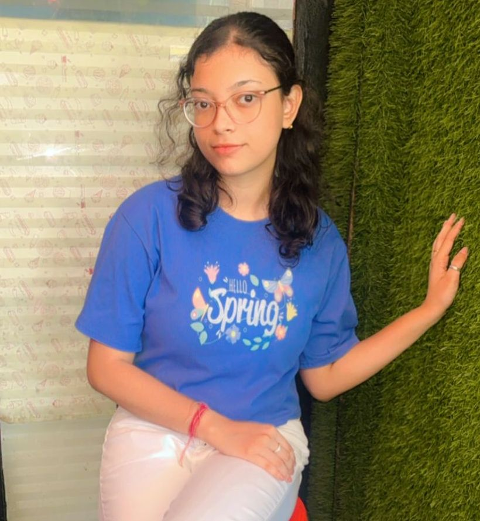

<html lang="en">
<head>
    <meta charset="UTF-8">
    <meta name="viewport" content="width=device-width, initial-scale=1.0">
</head>
<body>
    <h1>Ritu Dey</h1>
    
    <h2>Summary</h2>
    
I am a hardworking student interested in coding and networking

    

    <h2>Education</h2>
    <ul>
        <li>Institute of Technical Education and Research in Bachelors in Bachelors of Technology in Computer Science and engineering(2023-2027)</li>
    </ul>
    

    <h2>Experience :</h2>
    <ul>
        <li><h3>Internship in Octanet</h3></li>
       <ul>
        <li>Java Development internship in an online internship program from 1st September-30th September, 2024</li>
       </ul>
       <li><h3>Certifications</h3></li>
       <ul>
        <li>Courses in web development</li>
        <li>Courses in python from Harvard University</li>
       </ul>
</ul>

  <h2>Skills</h2>  
  <ol>
    <li> Java </li>
    <li> Python </li>
    <li> HTML </li>
    <li> CSS </li>
  </ol>
  

  <h2> Others: </h2>
  <pre> <a href="http://127.0.0.1:3000/My hobbies.html">My Hobbies</a>
  <a href="http://127.0.0.1:3000/contact.html">Contact Me</a>
</pre>
  <footer style="text-align:left">
    <small>
        © Ritu Dey. All rights reserved.
    </small>
  </footer> 
</body>
</html>
